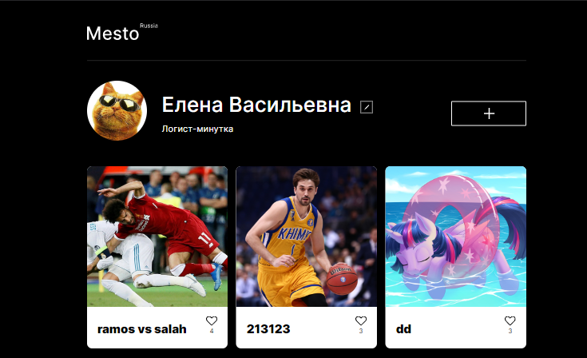
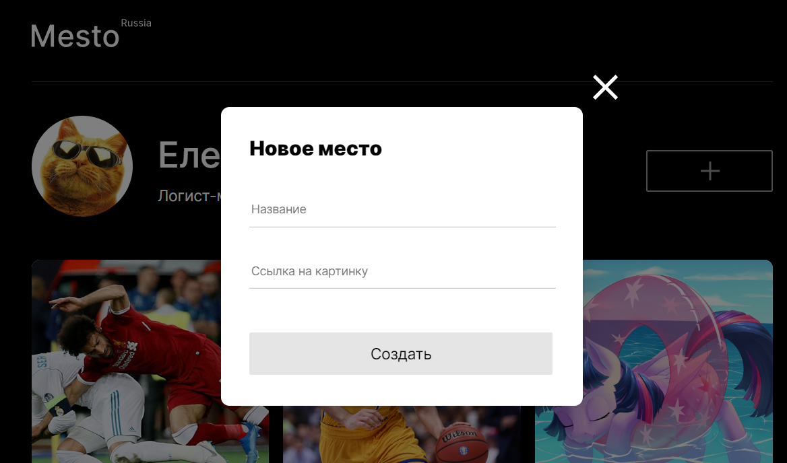

# Проект: Место

## О проекте:

Третья проектная работа на Яндекс. Практикум
Проект является интерактивной страницей, куда можно добавлять фотографии, удалять их и ставить лайки.

  

## Используемые технологии:

* Верстка на гридах и флексах;
* Адаптивный дизайн с помощью медиа-запросов;
* Плавность преходов открытитя и закрытия модальных окон с помощью Transition;
* Масштабирование изображений при изменении разрешения страницы;
* Использование JS при открытии и закрытии модального окна и заполнении формы;
* Использование JS при добавлении новых фотографий на страницу, функций удаления и лайка фотографий.
* Валидация всех форм средстами JS
* ООП
* Подключение проекта к серверу через Api

  

### Стек:
- HTML
- CSS
- JavaScript

&nbsp;
&nbsp;
&nbsp;

[Здесь можно посмотреть, как выглядит проект](https://elenasharnina.github.io/mesto/)
